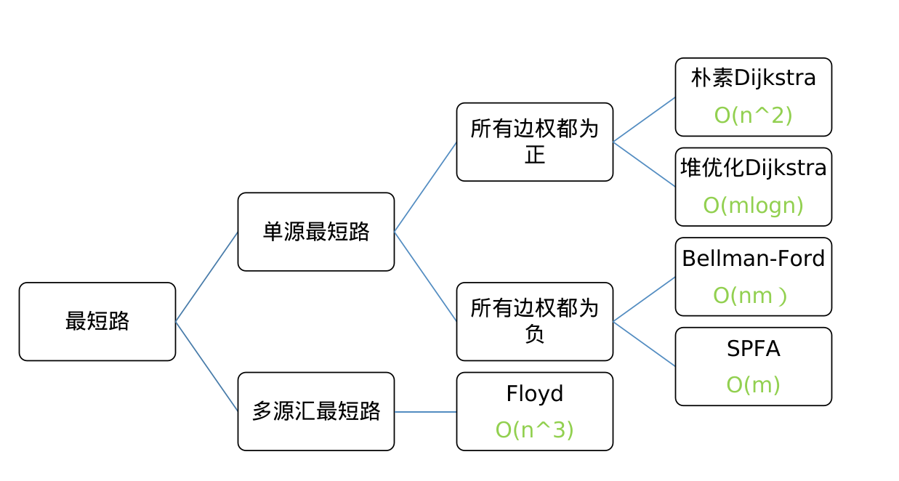
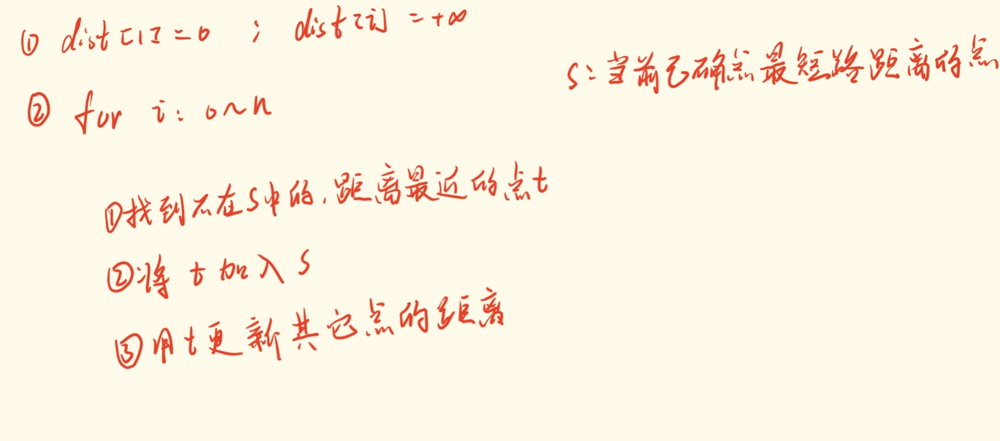
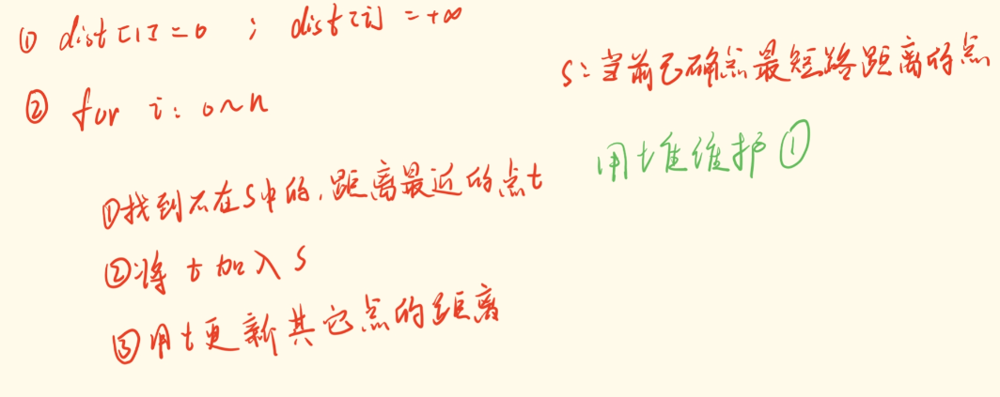
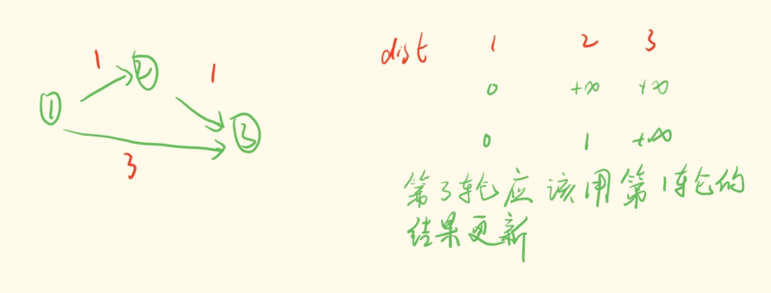
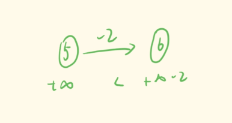
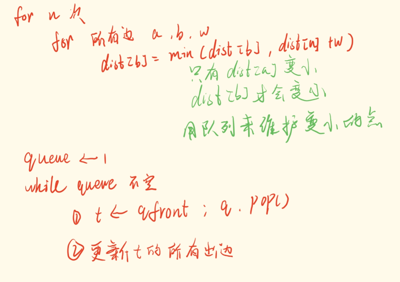
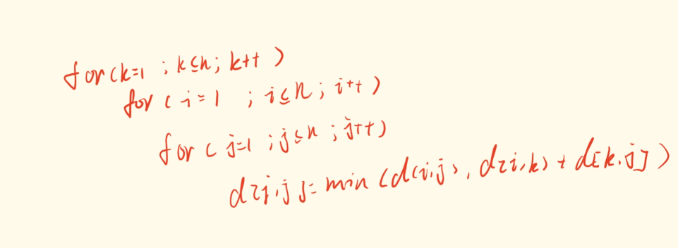

# 语法

## 1、生成随机数

```c++
srand((unsigned int)(time(nullptr)));
int a = rand() % 100；
```

## 2、priority_queue自定义比较函数

```c++
struct Compare{
    bool operator()(Attack A1,Attack A2) {
        return A1.a < A2.a;
    }
};
typedef priority_queue<Attack, vector<Attack>,Compare> q_Attack;
```

## 3、上取整

```c++
#include <cmath>
int c = ceil(3.5) // 4
```

## 4、IO操作

```c++
#include <fstream>

ifstream file("data.txt");
assert(file.is_open());
string line;
int count = 1;
while(getline(file,line)){
    cout << count++ << "\t" <<  line << endl;
}
file.close();
```


# 算法

## 1、数论

### 1、组合数

```c++
LL C(int a, int b){
    LL res = 0;
    for(int i = a, int j = 1; j <= b ;i--,j++){
        res = res * i / j;
    }
    return res;
}
```

### 2、最大公约数

```c++
int gcd(int a, int b){
    return b ? gcd(b, a %b) : a;
}
```

### 3、最大公约数与最小公倍数

$$
n = p_{1}^{a_1}\cdot p_{2}^{a_2}\cdot p_{3}^{a_3}... p_{k}^{a_k}\\
m = p_{1}^{b_1}\cdot p_{2}^{b_2}\cdot p_{3}^{b_3}...p_{k}^{b_k}\\
gcd(n,m)=p_{1}^{min(a_1,b_1)} \cdot p_{2}^{min(a_2,b_2)} \cdot p_{3}^{min(a_3,b_3)} ...p_{k}^{min(a_k,b_k)}\\
lcm(n,m)=p_{1}^{max(a_1,b_1)} \cdot p_{2}^{max(a_2,b_2)} \cdot p_{3}^{max(a_3,b_3)} ...p_{k}^{max(a_k,b_k)}
$$


## 2、二分

### 1、 在满足check中找左边界

```c++
int bsearch_1(int l, int r){
	while(l < r){
        int mid = l + r >> 1;
        if(check(mid)) r = mid;
        else l = mid + 1;
    }
    return l;
}
```

### 2、在满足check中找右边界 

```c++
int bsearch_1(int l, int r){
	while(l < r){
        int mid = l + r + 1 >> 1;
        if(check(mid)) l = mid;
        else r = mid - 1;
    }
    return l;
}
```

## 3、图论

---

### 1、最短路问题



* ### 朴素Dijkstra



```C++
void Dijkstra(int start) {
    dist[start] = 0;
    for (int i = start; i < N; i++) {
        int t = -1;
        for (int j = 1; j < N ; j++) {
            if(st[j])continue;
            if(t== -1 || dist[t] > dist[j]){
                t = j;
            }
        }
        st[t] = true;
        for(int j = 0; j < g[t].size(); j++){
            int id = g[t][j].id;
            dist[id] = min(dist[t] + g[t][j].w,dist[id]);
        }
    }
}
```

[习题](https://www.acwing.com/problem/content/851/)


* ### 堆优化Dijkstra



```c++
int Dijkstra(){
    dist[1] = 0;
    priority_queue<PII,vector<PII>,greater<PII>> heap;
    heap.push({0,1});
    while(heap.size()){
        int t = heap.top().second;
        heap.pop();
        if(st[t])continue;
        st[t] = true;
        for(int j = 0; j < g[t].size(); j++){
            int id = g[t][j].id;
            int w = g[t][j].w;
            dist[id] = min(dist[id], dist[t] + w);
            heap.push({dist[id],id});
        }
    }
}
```

小根堆初始化方式：**`priority_queue<PII,vector<PII>,greater<PII>> heap;`**

[习题](https://www.acwing.com/activity/content/problem/content/919/)


* ### Bellman-Ford


```C++
int Bellman_Ford(){
    memset(dist, 0x3f,sizeof dist);
    dist[1] = 0;
    for(int i = 0; i < k ;i++){
        memcpy(backup,dist,sizeof dist);
        for(int j = 0; j < m; j++){
            int a = edges[j].a;
            int b = edges[j].b;
            int w = edges[j].w;
            dist[b] = min(dist[b], backup[a] + w);
        }
    }
    if(dist[n] >= 0x3f3f3f3f / 2){
        cout << "impossible";
    }else{
        cout << dist[n]<< endl;
    }
}
```

代码解释：

* `memcpy(backup,dist,sizeof dist);`

​	防止用更新后的dist进行更新。



* `dist[n] >= 0x3f3f3f3f / 2`

​	因为纯在负权，所以不能用是否为最大值来判断有无最短路

​						

[习题](https://www.acwing.com/activity/content/problem/content/922/)


* ### SPFA

只要没有负环，就可以用SPFA



```c++
int SPFA(){
    memset(dist,0x3f,sizeof dist);
    dist[1] = 0;
    q.push(1);
    st[1] = true;
    while(q.size()){
        int t = q.front();
        q.pop();
        st[t] = false; //用于记录已经加入队列中点
        for(int i = 0; i < g[t].size(); i++){
            int id = g[t][i].id;
            int w = g[t][i].w;
            if(dist[id] > dist[t] + w){
                dist[id] = dist[t] + w;
                if(!st[id]){
                    q.push(id);
                    st[id] = true;
                }    
            }
             
        }
    }
    if(dist[n] == 0x3f3f3f3f){
        cout << "impossible";
    }else{
        cout << dist[n];
    }
    
}
```

[习题1](https://www.acwing.com/problem/content/description/853/) 	[习题2](https://www.acwing.com/problem/content/854/)


* Floyd

### 

```c++
void Floyd(){
    for(int k = 1; k <= n; k++){
        for(int i = 1; i <= n; i++){
            for(int j = 1; j <= n; j++){
                g[i][j] = min(g[i][j],g[i][k] + g[k][j]);
            }
        }
    }
}
```


# 常见问题

## 1、闰年

能被4整除但不能被100整除 || 能被400整除。

闰年二月有29天

## 2、时间复杂度

C++代码中的操作次数控制在 1e7∼1e8为最佳

## 3、数学

* $$
  (1^2+2^2+3^2+···+n^2) = \frac{n(n+1)(2n+1)}{6}
  $$

## 4、异或

`a ^ b = x --> a = x ^ b`

## 5、to_string 很耗时，不要用！！

## 6、最小公倍数

`a * b / gcd(a,b)`
